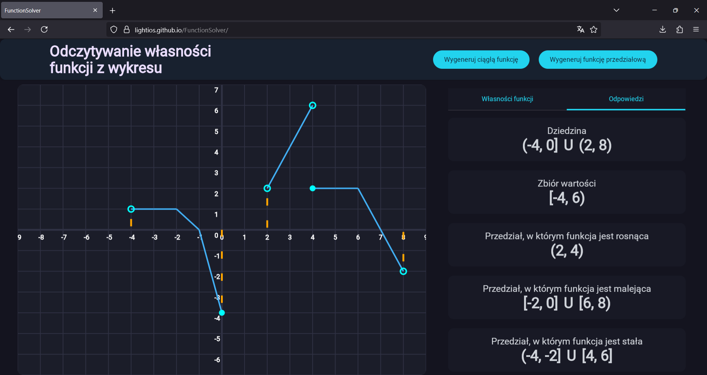

# 📦 Function Solver

> **A web application for practicing reading properties of functions from their graphs**

[👉 Live Demo](https://lightios.github.io/FunctionSolver/)

---

## 🌟 Features

- 🔢 Generation of continuous and piecewise functions
- ✍️ Input and automatic evaluation of answers
- 📘 Access to ready-made solutions
- 📊 Visualization of solution steps

---

## ℹ️ Overview

I am a math tutor, and this application was created for my students so they can **effectively practice interpreting properties of functions from graphs**.  
With Function Solver, you can practice:
- finding zeros of functions,
- identifying monotonicity,
- evaluating function values,
- locating local extrema,
- and other essential properties.

---

## 🛠️ Tech Stack

- **Kotlin Multiplatform** – for cross-platform development
- **Compose Multiplatform** – for building the UI
- **GitHub Pages** – for hosting the web version

The same core module will also be available on **mobile devices** as part of my commercial application **DayMath**.

---

## 📷 Screenshots

---

## 📄 License
© All rights reserved.
This project was created for educational purposes and will also be used as part of the DayMath commercial application.
